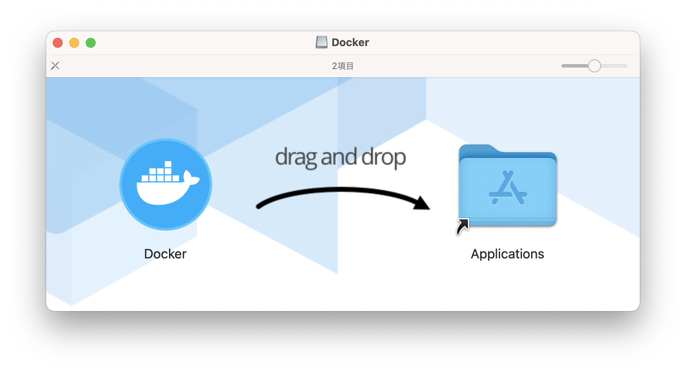

# Macでの環境構築

## CPUの確認

「このMacについて」を開き，CPUを確認する．下記のどちらに当てはまるかを確認して進む

- Intelの場合は下記の画像  
  
- Apple シリコンの場合は下記のリンク  
  [Apple シリコン搭載の Mac コンピュータ](https://support.apple.com/ja-jp/HT211814) 


## Dockerのダウンロード

1. [Docker Desktop](https://www.docker.com/products/docker-desktop)にアクセス
2. Intelの場合はMac with Intel Chip、Apple シリコンの場合はMac with Apple Chipをクリック
  
3. ダウンロードされたファイルをクリックして起動
4. Applicationsフォルダに移動
  - ドラッグ&ドロップで移動する．完了したらウィンドウは閉じて良い
  
4. 起動
  - Dockerを起動
    - アプリケーション → Dockerを起動
    - 「⌘ + スペース」で「Docker」と検索して起動

## インストールの確認

### 1. ターミナルを起動
- アプリケーション → その他 → ターミナルを起動
- 「⌘ + スペース」で「terminal」と検索して起動
など

### 2. コマンドで確認( *$は入力しなくて良い* )
```bash
$ docker --version
$ docker-compose --version
```

出力例(Windowsの例なので出力が合っていれば良い)


## 必要なファイルを準備

1. 以下のリンクから環境構築に使うファイルをダウンロードする
    * https://github.com/KuroiCc/docker-fastapi-mysql-app
    * 右の方にある緑色の Clone or download ボタンから ZIP を選択
   
2. zip ファイルを*デスクトップ*に移動
3. zipファイルを展開する

---
各自で行ってくるのはここまで。次の「環境構築」からは授業内で行う

---

# 使用方法

基本的にどの項目も毎回登場する

## 起動

1. ターミナルでダウンロードしたファイルがある場所に移動( *$は入力しなくて良い* )
  ```bash
  $ cd
  $ cd Desktop
  $ cd docker-fastapi-mysql-app-master
  ```
2. Dockerコンテナ起動( *$は入力しなくて良い* )
  ```bash
  $ docker-compose up
  ```
3. *注意* 初回はかなり時間がかかるので，下記のログが出力されるまではしばらく待機
  

## 停止

1. `docker-compose up` コマンドを実行したウィンドウで `Ctrl + c`


## 動作確認

1. 起動中に ~~`https://localhost:8000`~~ `http://localhost:8000`にアクセス
2. 下記の画面が表示されれば完了
  

