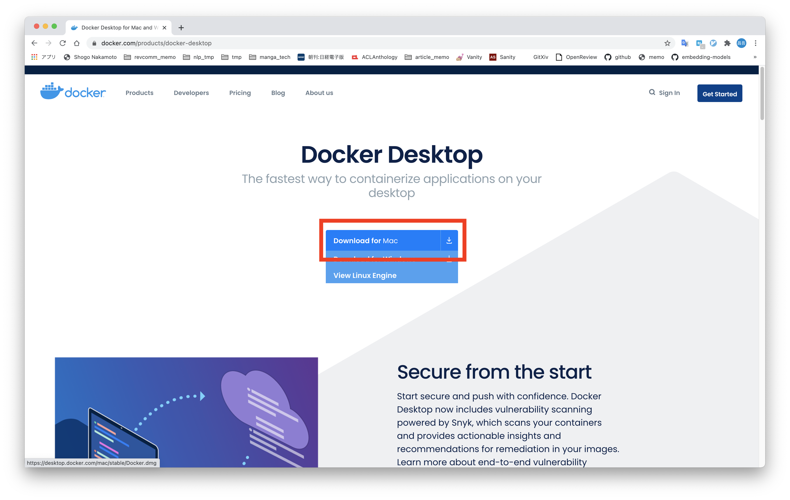

# Macユーザの環境構築手順
## 準備

### CPUの確認

「このMacについて」を開き，CPUを確認する．下記のどちらに当てはまるかを確認して進む

- Intelの場合[インテルの場合](image/intel.png) 
- Apple シリコンの場合[Apple シリコン搭載の Mac コンピュータ](https://support.apple.com/ja-jp/HT211814) 

#### Intelの場合

[Dockerのダウンロード](#Dockerのダウンロード)に進む

#### Apple シリコンの場合

Apple シリコンであることを講義スタッフに伝える

参考：[Apple Silicon 技術プレビュー](https://matsuand.github.io/docs.docker.jp.onthefly/docker-for-mac/apple-m1/)2021/3/31時点

### Dockerのダウンロード

1. Docker Desktopにアクセス

[Docker Desktop](https://www.docker.com/products/docker-desktop)


2. Download for Macをクリック


3. ダウンロードされたファイルをクリックして起動

4. Applicationsフォルダに移動

ドラッグ&ドロップで移動する．完了したらウィンドウは閉じて良い


4. 起動

Dockerをシャットダウンするたびに必要になる

下記のどちらかでDockerを起動
- アプリケーション → Dockerを起動
- 「⌘ + スペース」で「Docker」と検索して起動

### インストールの確認

下記のどちらかでターミナルを起動
- アプリケーション → その他 → ターミナルを起動
- 「⌘ + スペース」で「terminal」と検索して起動

以下のコマンドが通れば OK

**$は入力しなくて良い**

```bash
$ docker --version
$ docker-compose -verison
```

※ 出力例


### 必要なファイルを準備

1. 以下のリンクから環境構築に使うファイルをダウンロードする
    * https://github.com/marutaku/docker-fastapi-mysql-app
    * 右の方にある緑色の Clone or download ボタンから ZIP を選択
   

2. zip ファイルを**デスクトップ**に移動
3. zipファイルを展開する

---
各自で行ってくるのはここまで。次の「環境構築」からは授業内で行う**
---

## 使用方法

基本的にどの項目も毎回登場する

### 起動

1. ターミナルでダウンロードしたファイルがある場所に移動

**$は入力しなくて良い**

```bash
$ cd
$ cd Desktop
$ cd docker-fastapi-mysql-app
```

2. Dockerコンテナ起動(初回はpullとbuildも実行)

**$は入力しなくて良い**

```bash
$ docker-compose up
```

**注意**

初回はかなり時間がかかるので，下記のログが出力されるまではしばらく待機


### 停止
1. `docker-compose up` コマンドを実行したウィンドウで `Ctrl + c`


### 動作確認

1. 起動中に`https://localhost:8080` にアクセス
2. 下記の画面が表示されれば完了


