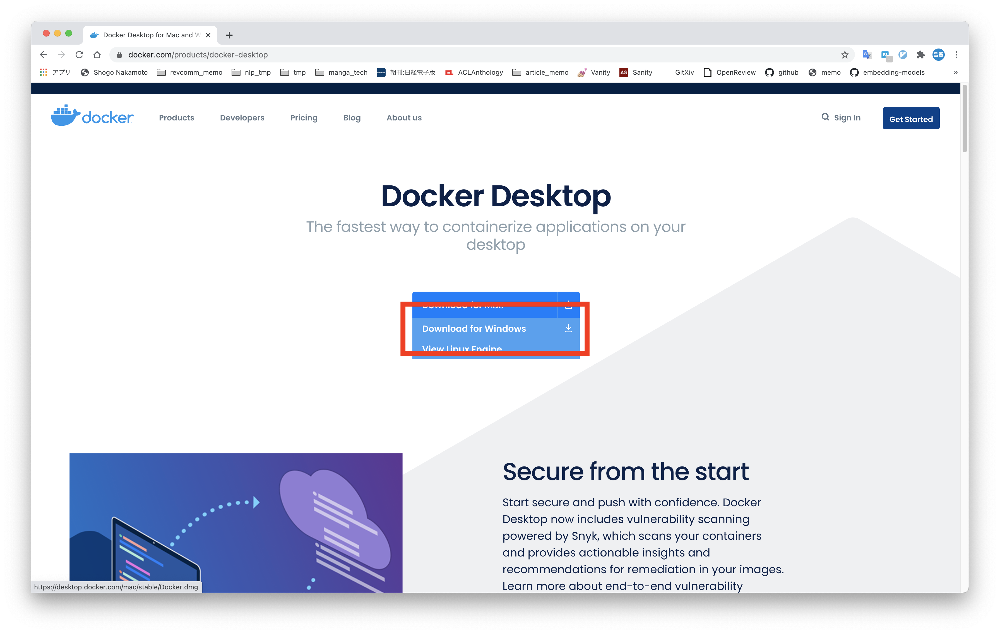
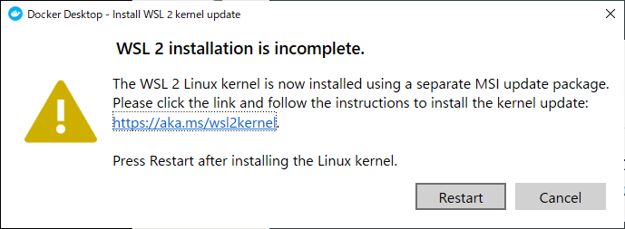
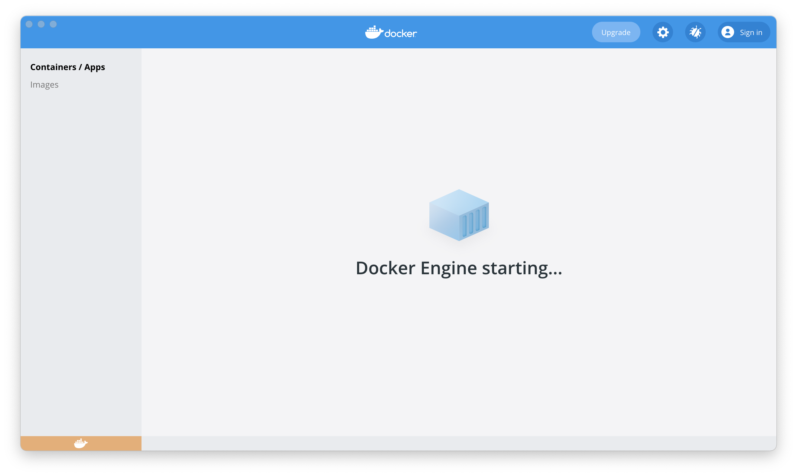
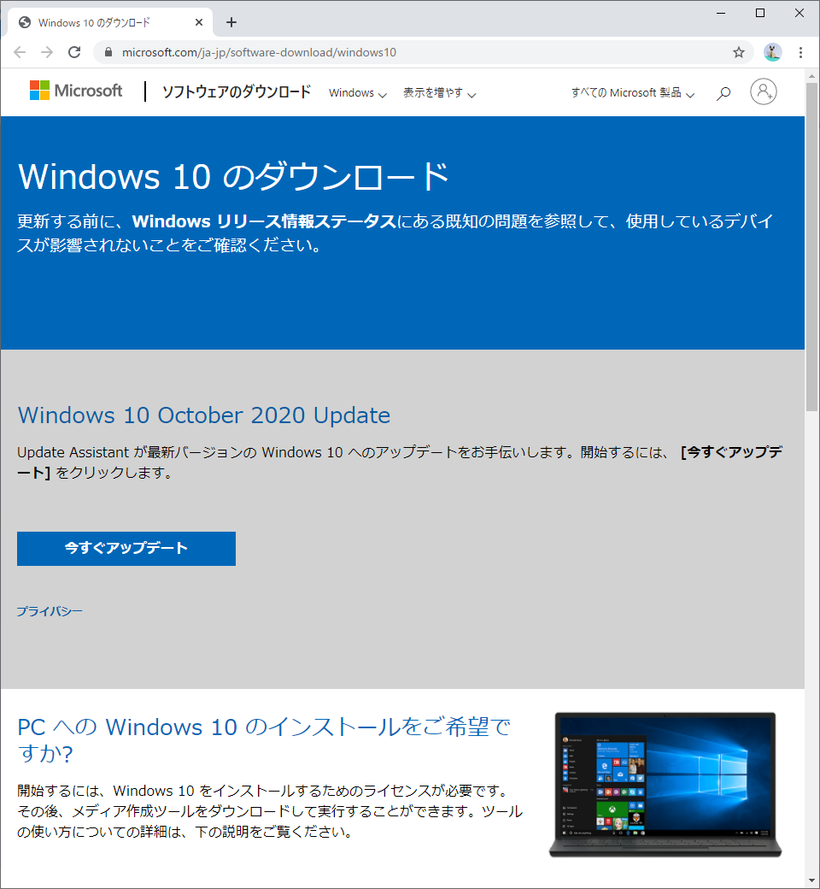
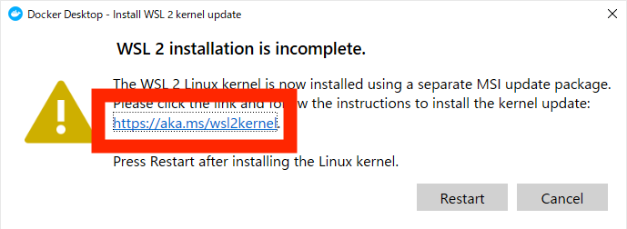
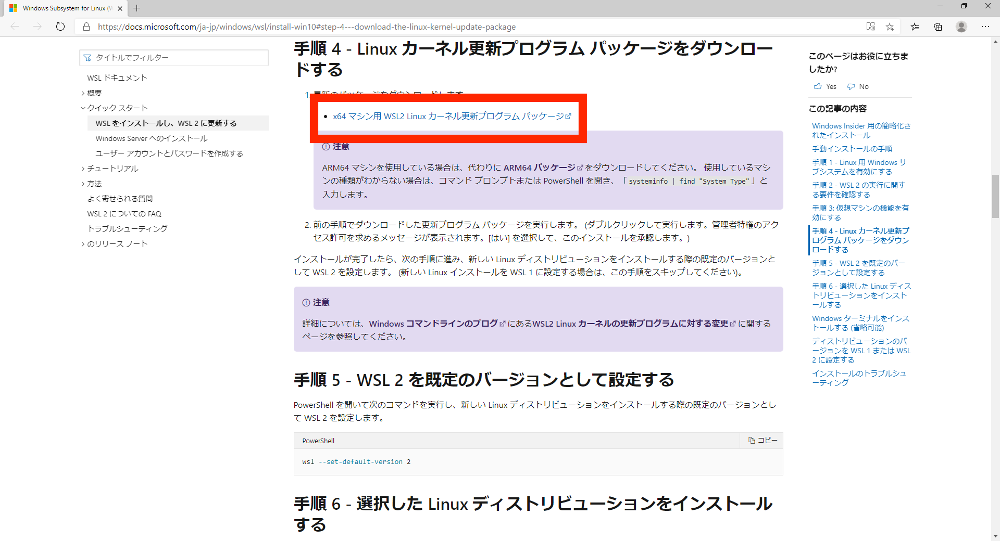
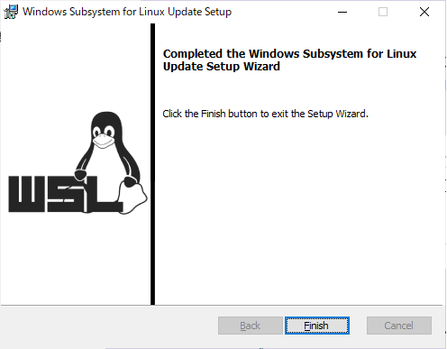

# Windowsでの環境構築

## 参考ページ
なにかあればこちらの記事と照らし合わせるとよい

[Windows 10 HomeへのDocker Desktop (ver 3.0.0) インストールが何事もなく簡単にできるようになっていた (2020.12時点)](https://qiita.com/zaki-lknr/items/db99909ba1eb27803456)

## Dockerのダウンロード

1. [Docker Desktop](https://www.docker.com/products/docker-desktop)にアクセス

2. Download for Windowsをクリック

  

3. ダウンロードされたファイルをクリックして起動

4. インストールの開始，設定などには手を加えず，次に進んでいく

  - もし下記の画面になったら[Windows Updateが必要な場合](#Windows-Updateが必要な場合)に進む

  

5. インストール完了

  - もし下記の画面が出たら[WSL2の更新が必要な場合](#WSL2の更新が必要な場合)に進む

  

4. Docker Desktopの起動

  - 下記に似た画面が出たらインストール及び起動が完了

  

## インストールの確認

### 1. コマンドプロンプトを起動
- 「Windowsキー」を押して「cmd」と入力して「Enter」を押して起動
- 「Windowsキー」を押して「コマンドプロンプト」を検索して起動

など

### 2. コマンドで確認( *$は入力しなくて良い* )

```bash
$ docker --version
$ docker-compose --version
```

出力例


## 必要なファイルを準備

1. 以下のリンクから環境構築に使うファイルをダウンロードする
  * https://github.com/KuroiCc/docker-fastapi-mysql-app
  * 右の方にある緑色の Clone or download ボタンから ZIP を選択
  

2. zip ファイルを*デスクトップ*に移動

3. zipファイルを展開する

---
各自で行ってくるのはここまで。次の「環境構築」からは授業内で行う

---

# 使用方法

基本的にどの項目も毎回登場する

## 起動

1. コマンドプロンプトでダウンロードしたファイルがある場所に移動( *$は入力しなくて良い* )
  ```bash
  $ cd
  $ cd Desktop
  $ cd docker-fastapi-mysql-app-master
  ```

2. Dockerコンテナ起動( *$は入力しなくて良い* )
  ```bash
  $ docker-compose up
  ```

3. *注意*: 初回はかなり時間がかかるので，下記のログが出力されるまではしばらく待機
  

## 停止

1. `docker-compose up` コマンドを実行したウィンドウで `Ctrl + c`

## 動作確認

1. 起動中に ~~`https://localhost:8000`~~ `http://localhost:8000` にアクセス

2. 下記の画面が表示されれば完了
  

## Windows Updateが必要な場合

1. [Windowsダウンロードのページ](https://www.microsoft.com/ja-jp/software-download/windows10IS://www.microsoft.com/ja-jp/software-download/windows10)に進み，下記のボタンからダウンロードする
  

2. [元の手順](#Dockerのダウンロード)に戻る

## WSL2の更新が必要な場合

1. 下記の画面の *「restart」ではなく* リンクをクリック
  

2. 開かれたページの下記のリンクをクリック
  

3. ダウンロードされたファイルを開いて，下記の画面が出たら特に変更なく進めていく
  

4. 下記の画面まで進めれば完了
  

5. 初めの画面の「restart」をクリックして再起動
  

6. 再起動が完了したら[元の手順](#Dockerのダウンロード)に戻る
