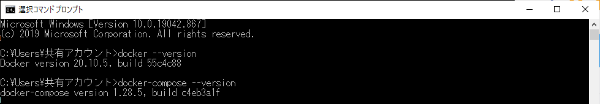
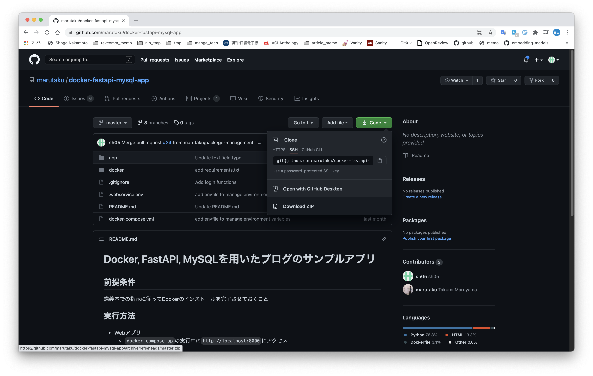
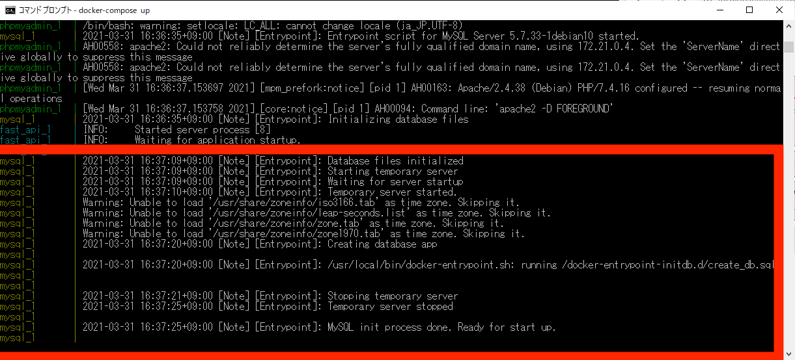
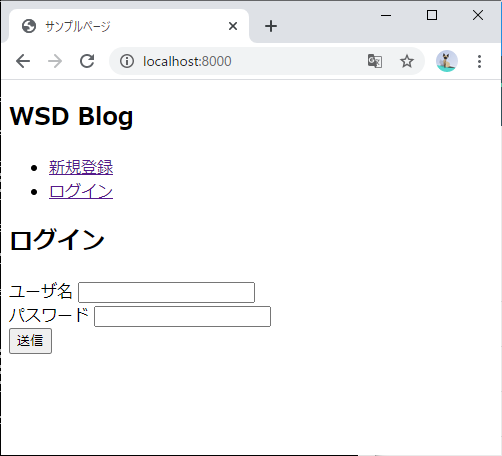

# Windowsでの環境構築

## Dockerのダウンロード

以下の記事を従ってDockerをインストールしてください。

[WSL2とDocker Desktop on WindowsでDocker環境を構築する](https://www.suzu6.net/posts/337-windows11-docker-desktop-wsl2/)

## インストールの確認

### 1. コマンドプロンプトを起動
- 「Windowsキー」を押して「cmd」と入力して「Enter」を押して起動
- 「Windowsキー」を押して「コマンドプロンプト」を検索して起動

など

### 2. コマンドで確認( *$は入力しなくて良い* )

```bash
$ docker --version
$ docker-compose --version
```

出力例



## 必要なファイルを準備

1. 以下のリンクから環境構築に使うファイルをダウンロードする
  * https://github.com/KuroiCc/docker-fastapi-mysql-app
  * 右の方にある緑色の Clone or download ボタンから ZIP を選択
  

2. zip ファイルを*デスクトップ*に移動

3. zipファイルを展開する

---
各自で行ってくるのはここまで。次の「環境構築」からは授業内で行う

---

# 使用方法

基本的にどの項目も毎回登場する

## 起動

1. コマンドプロンプトでダウンロードしたファイルがある場所に移動( *$は入力しなくて良い* )
  ```bash
  $ cd
  $ cd Desktop
  $ cd docker-fastapi-mysql-app-master
  ```

2. Dockerコンテナ起動( *$は入力しなくて良い* )
  ```bash
  $ docker-compose up
  ```

3. *注意*: 初回はかなり時間がかかるので，下記のログが出力されるまではしばらく待機
  

## 停止

1. `docker-compose up` コマンドを実行したウィンドウで `Ctrl + c`

## 動作確認

1. 起動中に ~~`https://localhost:8000`~~ `http://localhost:8000` にアクセス

2. 下記の画面が表示されれば完了
  
